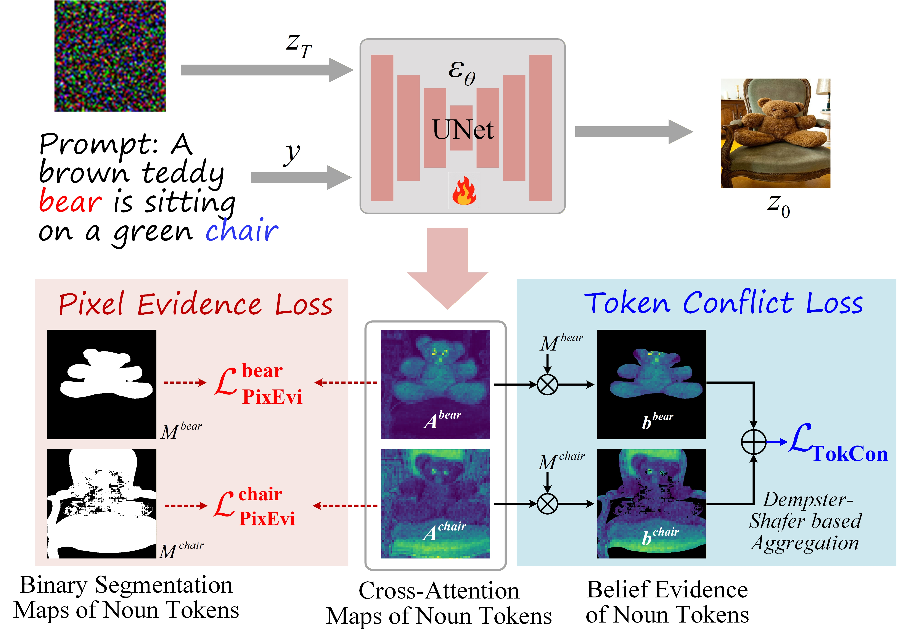

<div align="center">
  
# ELDiff: When Evidential Learning Meets Text-to-Image Diffusion

[Qingtao Pan](https://qingtaopan.github.io/), [Kai Ye](https://scholar.google.com/citations?hl=zh-CN&user=k6mAT9AAAAAJ), [Zhihao Dou](https://scholar.google.com/citations?user=JiBGiB8AAAAJ&hl=zh-CN&oi=ao), [Bing Ji](https://www.researchgate.net/profile/Bing-Ji-jibing), and [Shuo Li](https://case.edu/engineering/about/faculty-and-staff-directory/shuo-li)

**ECCV, 2026**

<a href='https://arxiv.org/abs/2603.11220'></a>

</div>

## Overview
In this paper, we propose ELDiff, an evidential learning-supervised T2I diffusion model, which leverages the advantages of uncertainty metric and conflict detection to enhance the fault tolerance of unreliable segmentation maps and suppress semantic conflicts, strengthening object-wise consistency learning. Specifically, a pixel evidence loss is proposed to restrain overconfidence in unreliable labels through evidential regularization, and a token conflict loss is designed to weaken the contradiction between semantics through optimizing a measured conflict factor.
<p align="center">
  </a> <br>
</p>

## 🆕 Models

| Stable Diffusion Version | Checkpoint |
|:------------------------:|:------------:|
| v1.4                     | [ELDiff_SD14](https://huggingface.co/mlpc-lab/TokenCompose_SD14_A)    |
| v2.1                     | [ELDiff_SD21](https://huggingface.co/mlpc-lab/TokenCompose_SD21_A)    

You can use the following code to download our checkpoints and generate images:
```python
import torch
from diffusers import StableDiffusionPipeline

model_id = "./ELDiff_SD14"
device = "cuda"

pipe = StableDiffusionPipeline.from_pretrained(model_id, torch_dtype=torch.float32)
pipe = pipe.to(device)

prompt = "A cheese cat is sucking catnip"
image = pipe(prompt).images[0]  
    
image.save("cat.png")
```

## 🌏 Environment Setup
Create and activate the environment:
```bash
conda create -n ELDiff python=3.8.5
conda activate ELDiff
conda install pytorch==1.13.1 torchvision==0.14.1 torchaudio==0.13.1 pytorch-cuda=11.7 -c pytorch -c nvidia
pip install -r requirements.txt
```

## 🗂️ Fine-tuning Data Setup
### 1. Setup the COCO Image Data

```bash
cd train/data
# download COCO train2017
wget http://images.cocodataset.org/zips/train2017.zip
unzip train2017.zip
rm train2017.zip
bash coco_data_setup.sh
```

After this step, you should have the following structure under the `train/data`  directory:

```
train/data/
    coco_gsam_img/
        train/
            000000000142.jpg
            000000000370.jpg
            ...
```

### 2. Setup Token-wise Grounded Segmentation Maps

Download COCO segmentation data from [Google Drive](https://drive.google.com/file/d/16uoQpfZ0O-NW92HuaCaFU8K4cGHHbv4R/view?usp=drive_link) and put it under `train/data` directory.

After this step, you should have the following structure under the `train/data` directory:

```
train/data/
    coco_gsam_img/
        train/
            000000000142.jpg
            000000000370.jpg
            ...
    coco_gsam_seg.tar
```

Then, run the following command to unzip the segmentation data:

```bash
cd train/data
tar -xvf coco_gsam_seg.tar
rm coco_gsam_seg.tar
```

After the setup, you should have the following structure under the `train/data` directory:

```
train/data/
    coco_gsam_img/
        train/
            000000000142.jpg
            000000000370.jpg
            ...
    coco_gsam_seg/
        000000000142/
            mask_000000000142_bananas.png
            mask_000000000142_bread.png
            ...
        000000000370/
            mask_000000000370_bananas.png
            mask_000000000370_bread.png
            ...
        ...
```

## 🔥 Fine-tuning 
use the following command:
```bash
cd train
bash train.sh
```
The results will be saved under `train/results` directory.

## 📜 License

This repository is released under the [Apache 2.0](LICENSE) license. 

## 🙏 Acknowledgement

Our code is built upon [diffusers](https://github.com/huggingface/diffusers), [prompt-to-prompt](https://github.com/google/prompt-to-prompt), [VISOR](https://github.com/microsoft/VISOR), [Grounded-Segment-Anything](https://github.com/IDEA-Research/Grounded-Segment-Anything), [CLIP](https://github.com/openai/CLIP), and [TokenCompose](https://github.com/mlpc-ucsd/TokenCompose). We thank all these authors for their nicely open sourced code and their great contributions to the community.

## 📚 Citation

If you find our work useful, please consider citing:
```bibtex

```


